# preexplorer

Easy plotter and saver of simple data. Handy tool for development stage or small computational projects. Save data, have a quick view and an initial [gnuplot](http://www.gnuplot.info/) script to plot it. 

If you are looking for a pure Rust plotter, check out [`plotters`](https://crates.io/crates/plotters).

# Purpose

Do you have a costly process in Rust and want to save the data for postprocessing?

Would you like to still have a basic glance to check it and leave fine-tuning of the plot for later?

This is the crate for you!

# Work flow

1. Compute your thing in Rust
2. Pass the results to a suitable struct from ``preexplorer``, or use the ``preexplore`` method.
3. Use the method ``plot`` or ``plot_later``. 

After ``cargo run``, your data is saved and a suitable first script for gnuplot to plot the data is saved. If you used ``plot``, you will get a plot by gnuplot that you can save. 

The gnuplot script is located in 

``target\\preexplorer\\plots\\my_identifier.gnu``

where ``my_identifier`` is the name you gave in rust to the plot. 

Therefore, to run it in gnuplot (and get the plot again), run from the console

``gnuplot target\\preexplorer\\plots\\my_identifier.gnu``

- Want a different plot? Change this file according to your needs and run again. 

- Want to use gnuplot as an interactive plotting engine? Run ``gnuplot`` in the console, copy and paste the script and keep going with your favorite gnuplot commands.

# Main features

- Easy plotting
- Easy comparison
- Implementable traits
- Extensive documentation

# Gallery

## Sequences
<a href="https://github.com/saona-raimundo/preexplorer/blob/master/examples/sequence/main.rs"></img></a>	<a href="https://github.com/saona-raimundo/preexplorer/blob/master/examples/sequences/main.rs"></img></a>

<a href="https://github.com/saona-raimundo/preexplorer/blob/master/examples/sequence_bin/main.rs">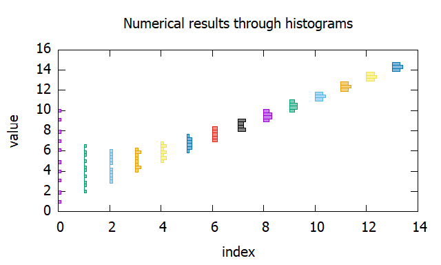</img></a>	<a href="https://github.com/saona-raimundo/preexplorer/blob/master/examples/sequence_bins/main.rs">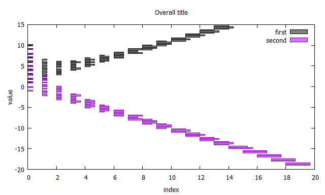</img></a>

<a href="https://github.com/saona-raimundo/preexplorer/blob/master/examples/sequence_error/main.rs">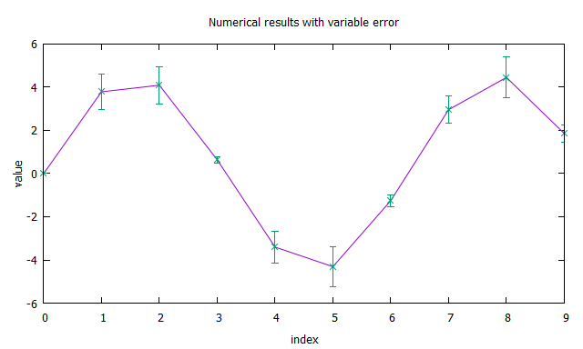</img></a>	<a href="https://github.com/saona-raimundo/preexplorer/blob/master/examples/sequence_errors/main.rs">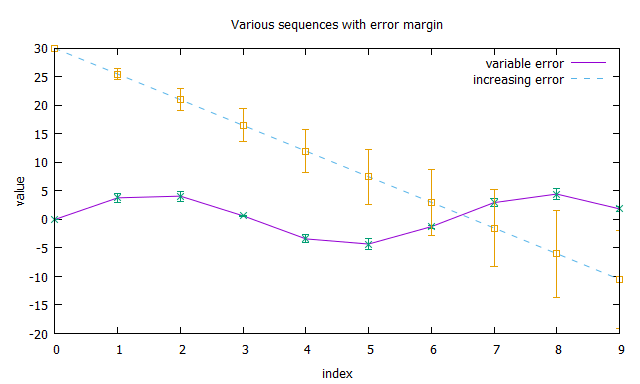</img></a>

<a href="https://github.com/saona-raimundo/preexplorer/blob/master/examples/sequence_violin/main.rs">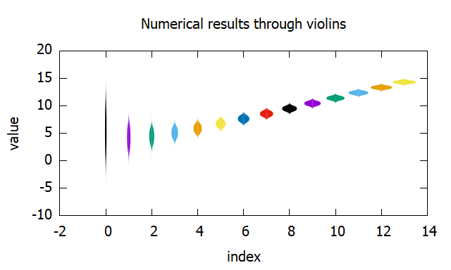</img></a>	<a href="https://github.com/saona-raimundo/preexplorer/blob/master/examples/sequence_violins/main.rs">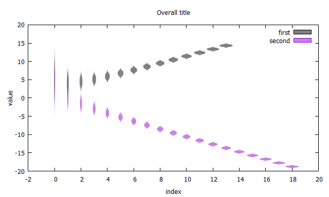</img></a>

## Processes
<a href="https://github.com/saona-raimundo/preexplorer/blob/master/examples/process/main.rs"></img></a>	<a href="https://github.com/saona-raimundo/preexplorer/blob/master/examples/processes/main.rs"></img></a>

<a href="https://github.com/saona-raimundo/preexplorer/blob/master/examples/process_bin/main.rs">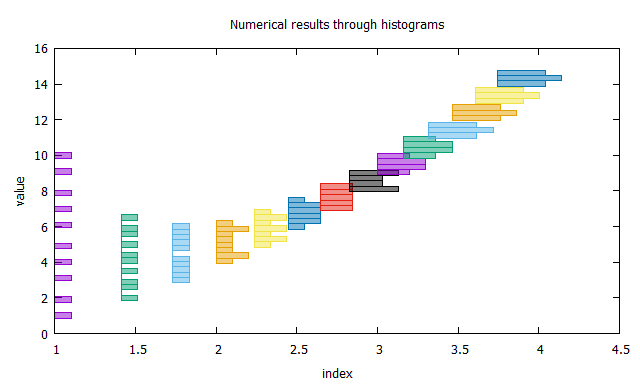</img></a>	<a href="https://github.com/saona-raimundo/preexplorer/blob/master/examples/process_bins/main.rs"></img></a>

<a href="https://github.com/saona-raimundo/preexplorer/blob/master/examples/process_error/main.rs">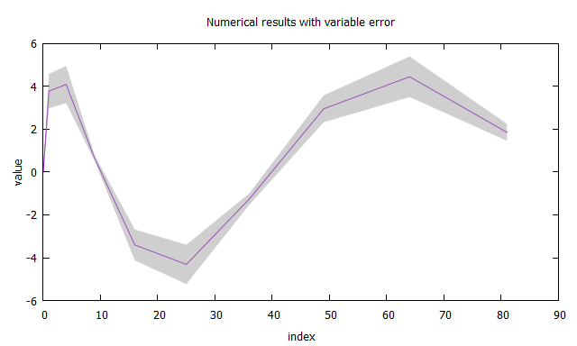</img></a>	<a href="https://github.com/saona-raimundo/preexplorer/blob/master/examples/process_errors/main.rs">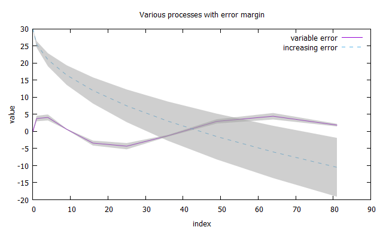</img></a>

<a href="https://github.com/saona-raimundo/preexplorer/blob/master/examples/process_violin/main.rs">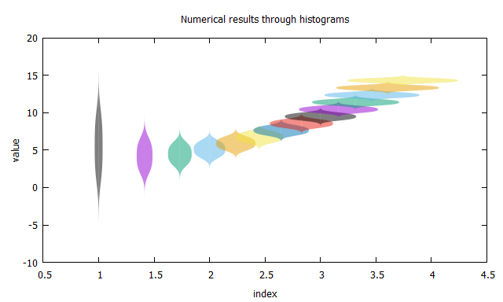</img></a>	<a href="https://github.com/saona-raimundo/preexplorer/blob/master/examples/process_violins/main.rs">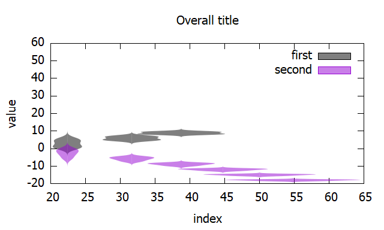</img></a>

## Densities
<a href="https://github.com/saona-raimundo/preexplorer/blob/master/examples/density/main.rs"></img></a>	<a href="https://github.com/saona-raimundo/preexplorer/blob/master/examples/densities/main.rs"></img></a>

## Heatmaps
<a href="https://github.com/saona-raimundo/preexplorer/blob/master/examples/heatmap/main.rs">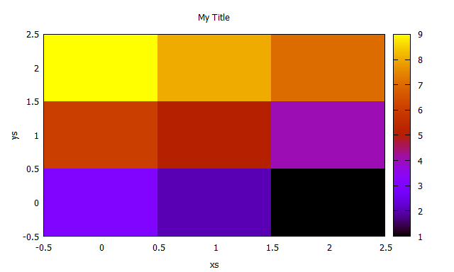</img></a>	<a href="https://github.com/saona-raimundo/preexplorer/blob/master/examples/heatmaps/main.rs">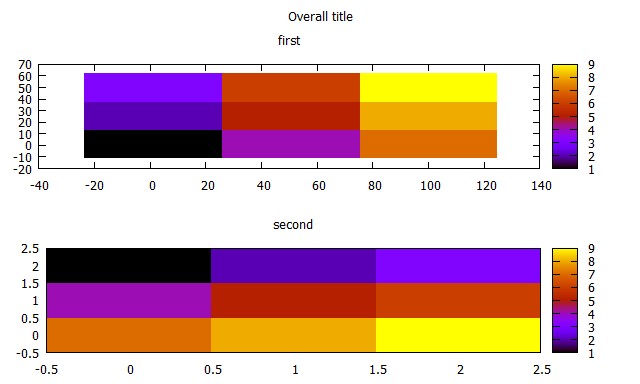</img></a>

## Contour
<a href="https://github.com/saona-raimundo/preexplorer/blob/master/examples/contour/main.rs">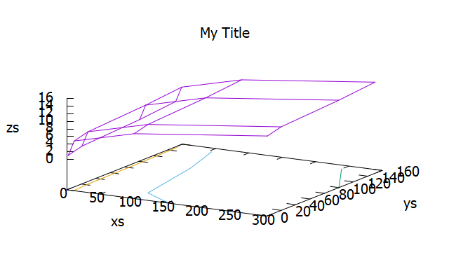</img></a>	

For more, see the folder [examples](https://github.com/saona-raimundo/preexplorer/tree/master/examples). 

# Installation

- Download and [install gnuplot](http://www.gnuplot.info/download.html), a command line engine for plotting. (Note that the gnuplot project has nothing to do with GNU).
- Add ``preexplorer = "*"`` to your ``Cargo.toml`` file under ``[dependencies]``.
- I suggest to simply go with ``use preexplorer::prelude::*;`` in your binary, and then use the short-name ``pre::...`` and the ``preexplore`` method directly in iterators and tuple of iterators.

# Q & A

1. When comparing processes (`Process`-related structs), why must they be the same structs? 
   The comparison of processes (`Processes`-related structs) are a collection of processes. As such, it works as `Vec<Process>`, so two process structs must be the same type to be compared.
2. Are there n-dimensional variants?
   No, it is out of scope. If you want to implement similar functionalities, you can do so easily based on the source code for `Data`. 
3. How to deactivate some options, e.g. tics?
   All structs implement the trait `Configurable`. Each option has documented how to disable it in its corresponding method.

# Disclaimer

There is no connection with the gnuplot project.

# Changelog

See [Changelog](https://github.com/saona-raimundo/preexplorer/blob/master/Changelog.md).

# References

A nice overview of what a good plot should look like: https://serialmentor.com/dataviz/

# For the reader

Has this project been useful to you? How? :)
Let me know through a github issue!

