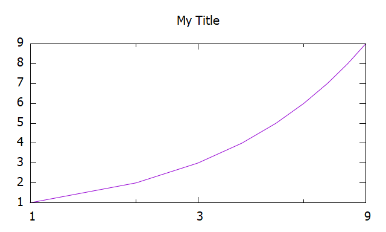
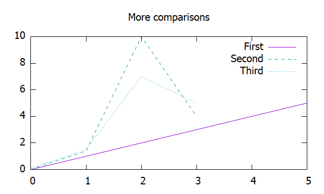
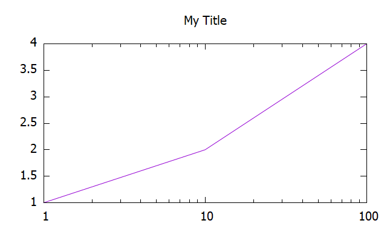
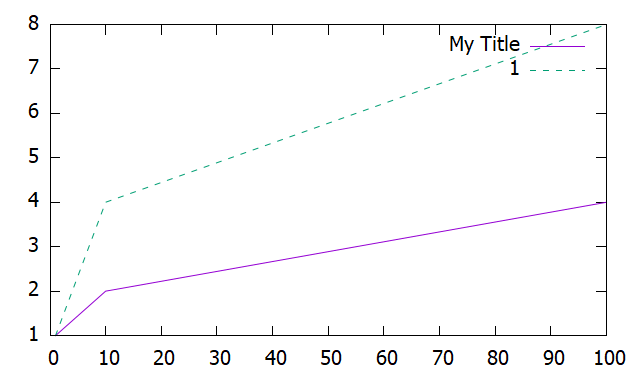
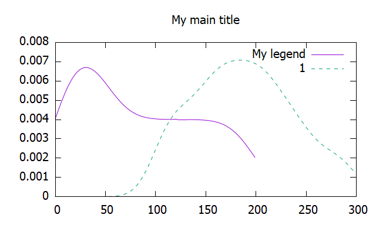

# preexplorer

Easy plotter and saver of simple data. Handy tool for development stage or small computational projects. Save data, have a quick view and an initial [gnuplot](http://www.gnuplot.info/) script to plot it. 

If you are looking for a pure Rust plotter, check out [plotters](https://crates.io/crates/plotters).

# Purpose

Do you have a costly process in Rust and want to save the data for postprocessing?
Would you like to still have a basic glance to check it and leave fine-tuning of the plot for later?
This is the crate for you!

# Work flow

1. Compute your thing in Rust
2. Pass the results to a suitable struct from ``preexplorer``, or use the ``preexplore`` method.
3. Use the method ``plot`` or ``plot_later``. 

In both cases, after ``cargo run``, your data is saved and a suitable first script for gnuplot to plot it is saved too. If you used ``plot``, you will get a plot by gnuplot that you can save. 

To get the plot again, run from the console

``gnuplot target\\preexplorer\\plots\\my_identifier.gnu``,

where ``my_identifier`` is the name you gave in rust. That is the location of the script for gnuplot.

Want a different plot? Change this file according to your needs and run again. 

Want to use gnuplot as an interactive plotting engine? Run ``gnuplot`` in the console, copy and paste the script and keep going with your favorite gnuplot commands.

# Main features

- Easy plotting
- Easy comparison
- Implementable traits
- Extensive documentation

# Gallery

<a href="https://github.com/rasa200/preexplorer/blob/master/examples/sequence/main.rs"></img></a>	<a href="https://github.com/rasa200/preexplorer/blob/master/examples/sequences/main.rs">
</img></a>

<a href="https://github.com/rasa200/preexplorer/blob/master/examples/process/main.rs"></img></a>	<a href="https://github.com/rasa200/preexplorer/blob/master/examples/processes/main.rs">
	</img></a>

<a href="https://github.com/rasa200/preexplorer/blob/master/examples/density/main.rs"></img></a>	<a href="https://github.com/rasa200/preexplorer/blob/master/examples/densities/main.rs">
    </img></a>

For more, see the folder [examples](https://github.com/rasa200/preexplorer/tree/master/examples). 

# Installation

- Download and [install gnuplot](http://www.gnuplot.info/download.html), a command line engine for plotting. (Note that the gnuplot project has nothing to do with GNU).
- Add ``preexplorer = "*"`` to your ``Cargo.toml`` file under ``[dependencies]``.
- I suggest to simply go with ``use preexplorer::prelude::*;`` in your binary, and then use the short-name ``pre::...`` and the ``preexplore`` method directly in iterators and tuple of iterators.

# Future

- [ ] New Structs for error plotting
  - [ ] SequenceWithError 
  - [ ] ProcessWithError
- [ ] More senses involved in exploration
  - [ ] Audio
    - [ ] audify()
    - [ ] sonify()

# Q & A

1. Why processes must be the same structs to be compared? 
   Because of Rust explicit typing: comparisons need to save an explicit type. 
2. Are there n-dimensional variants?
   No, it is out of scope. Please implement your own plot script for that. You can do so easily based in the Data struct. 
3. How to deactivate some options, e.g. tics?
   What would represent the empty value instead of None. This happens because of inferring type errors in Rust.

# Disclaimer

There is no connection with the gnuplot project.

# Changelog

See [Changelog](https://github.com/rasa200/preexplorer/blob/master/Changelog.md).
